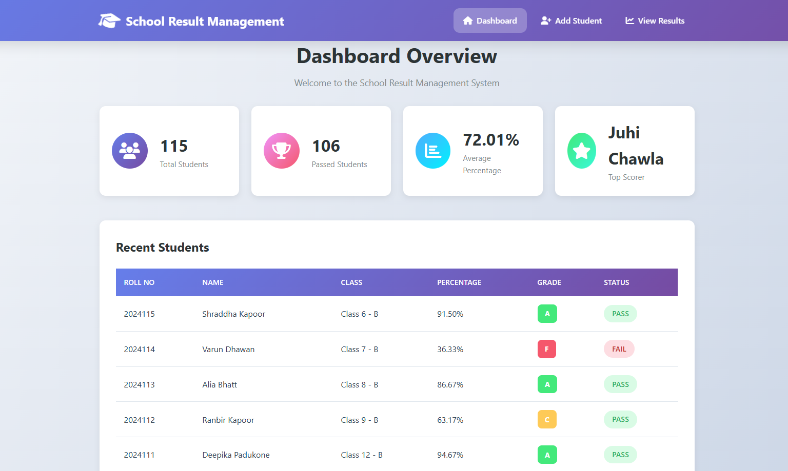
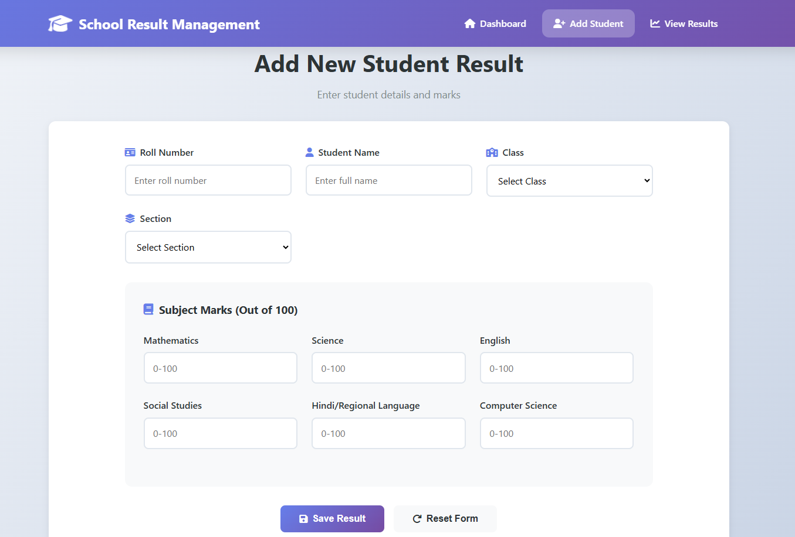
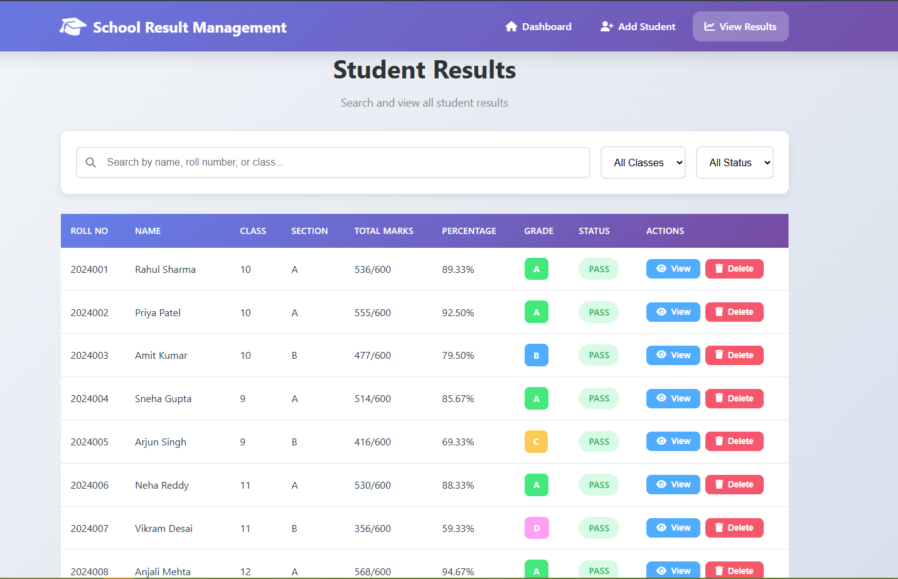

# School Result Management System

A modern, front-end School Result Management System built with HTML, CSS, and JavaScript. Student performance data is persisted in the browser's `localStorage`, so the experience works entirely offline without a backend.

## Features
- Dashboard displaying total students, pass/fail counts, averages, and top performers
- Recent students table highlighting the latest result entries
- Guided form for adding new student results with validation-ready inputs
- Computed grades and statuses based on subject-wise marks
- Searchable, filterable results table with view and delete actions
- Local JSON-backed storage seeded with sample records on first load

## Color Scheme
- Primary: `#6750A4` (Indigo/Purple)
- Gradient Accent: `linear-gradient(90deg, #6C63FF 0%, #8E54E9 100%)`
- Success: `#4CAF50`
- Warning: `#FFB300`
- Danger: `#F4511E`
- Neutrals: light backgrounds `#F5F7FB`, dark text `#1F1B2E`

## How to Use
- Open `index.html` in any modern web browser
- Navigate the top navigation bar to access Dashboard, Add Student, or View Results
- Fill in the New Student Result form and click `Save Result` to add an entry
- Use the global search, class filter, and status filter to find specific students
- Click `View` for a detailed modal (if implemented) or `Delete` to remove a record with confirmation

## Data Storage
All records are stored as JSON in the browser's `localStorage`. Sample data populates on first visit so you can explore the UI immediately. Updates persist between sessions on the same device and browser.

## Browser Compatibility
The application runs in any up-to-date browser that supports:
- HTML5
- CSS3
- ES6 JavaScript
- `localStorage` API

## Project Structure
- `index.html` — Main application layout and navigation
- `styles.css` — Styling rules, theming, and responsive behavior
- `script.js` — Core application logic, data management, and UI interactions
- `README.md` — Project documentation and usage guide

## Screenshots

	

	

	

## Getting Started for Development
- Clone or download the repository
- Open the project folder in your preferred editor
- Launch `index.html` through a local web server or directly in the browser for quick testing
- Adjust `script.js` to customize data models or extend functionality
